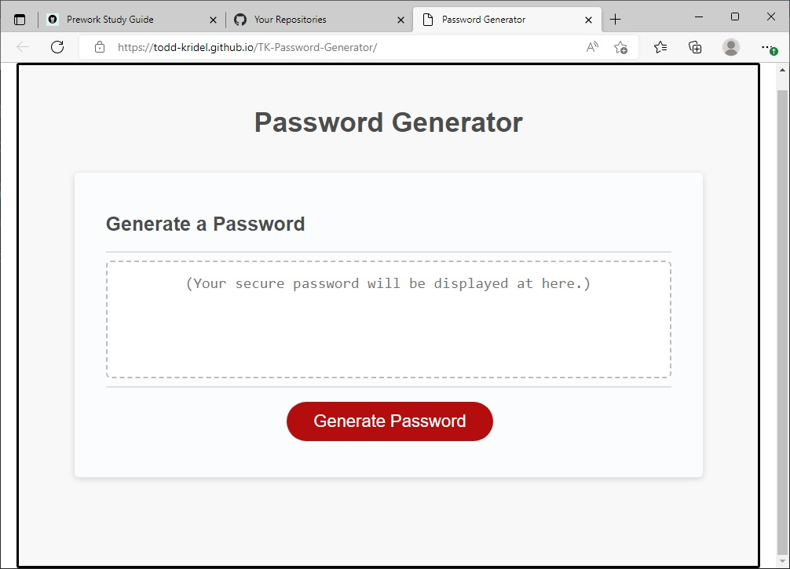

# Bootcamp Module 3 Challenge Assignment -- a Randomized Password Generator

## Description

This current Module 3 Challenge assignment -- a random and reasonably-secure Password Generator application -- provided a good mechanism for learning introductory JavaScript programming. A large portion and effort of my personal assignment was for a significant attempt to consider about and address concerns of data validation for various functions and processes; as well as varied usages of global-scope variables and local-scope variables. The assignment was also a good mechanism for examining and analyzing and understanding and then designing the external-file Cascading Style Sheets (CSS) -- design appearance -- code and HTML code of a webpage that had to be linked to the new JavaScript code. This assignment provided some additional attention to the concepts/objectives of "Accessibility" and "Responsiveness".

----

The objectives -- user story and acceptance criteria items -- of the assignment were as follows:

[ User Story ]

AS AN employee with access to sensitive data
I WANT to randomly generate a password that meets certain criteria
SO THAT I can create a strong password that provides greater security

[ Acceptance Criteria ]

GIVEN I need a new, secure password...

WHEN I click the button to generate a password
* THEN I am presented with a series of prompts for password criteria

WHEN prompted for password criteria
* THEN I select which criteria to include in the password

WHEN prompted for the length of the password
* THEN I choose a length of at least 8 characters and no more than 128 characters

WHEN asked for character types to include in the password
* THEN I confirm whether or not to include lowercase, uppercase, numeric, and/or special characters

WHEN I answer each prompt
* THEN my input should be validated and at least one character type should be selected

WHEN all prompts are answered
* THEN a password is generated that matches the selected criteria

WHEN the password is generated
* THEN the password is either displayed in an alert or written to the page

[ Additional Grading Criteria ]

Also good coding practices and good GitHub/Git repository configuration.

## Installation

Make sure that you have a GitHub membership and account to be able to view the repository of the assignment webpage system. The published GitHub Pages view of the website should be accessible on the public internet access URL without a need to have a GitHub membership/account.

## Usage

To use this password generator webpage...

1. Click the "Generate Password" button and view the displayed information and respond to it as-necessary.

The following picture shows the appearance of the upgraded webpage:

The following URL is for the GitHub Pages published public view of Todd Kridel's Coding Bootcamp Module 1 Challenge assignment webpage: "https://todd-kridel.github.io/TK-Password-Generator/".

## Credits

The starter code that was used for this password generator challenge was created by GitHub member "Xandromus" and supplied in the public bootcamp-related repository that was/is named "git@github.com:coding-boot-camp/friendly-parakeet.git".

## License

MIT License

Copyright (c) 2022 DU Full-Stack Web Development Coding Boot Camp

Permission is hereby granted, free of charge, to any person obtaining a copy
of this software and associated documentation files (the "Software"), to deal
in the Software without restriction, including without limitation the rights
to use, copy, modify, merge, publish, distribute, sublicense, and/or sell
copies of the Software, and to permit persons to whom the Software is
furnished to do so, subject to the following conditions:

The above copyright notice and this permission notice shall be included in all
copies or substantial portions of the Software.

THE SOFTWARE IS PROVIDED "AS IS", WITHOUT WARRANTY OF ANY KIND, EXPRESS OR
IMPLIED, INCLUDING BUT NOT LIMITED TO THE WARRANTIES OF MERCHANTABILITY,
FITNESS FOR A PARTICULAR PURPOSE AND NONINFRINGEMENT. IN NO EVENT SHALL THE
AUTHORS OR COPYRIGHT HOLDERS BE LIABLE FOR ANY CLAIM, DAMAGES OR OTHER
LIABILITY, WHETHER IN AN ACTION OF CONTRACT, TORT OR OTHERWISE, ARISING FROM,
OUT OF OR IN CONNECTION WITH THE SOFTWARE OR THE USE OR OTHER DEALINGS IN THE
SOFTWARE.

